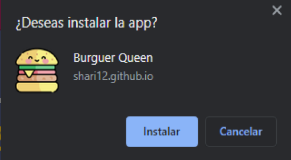
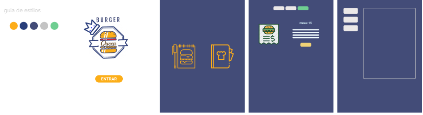
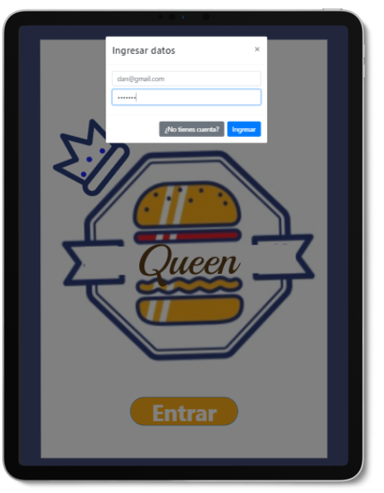
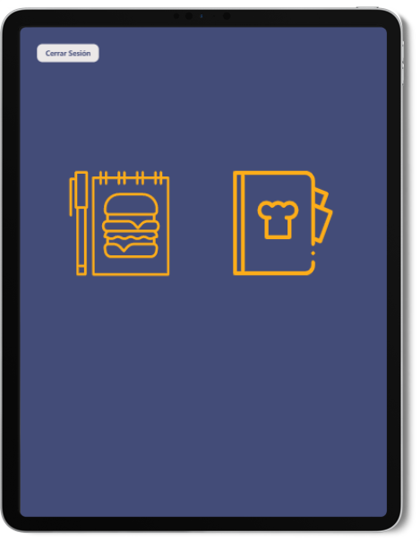
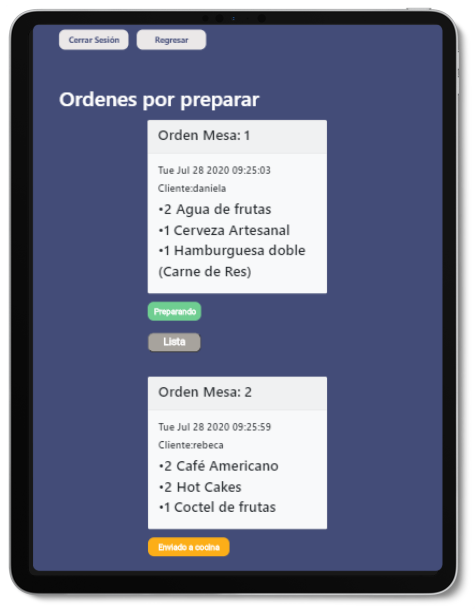
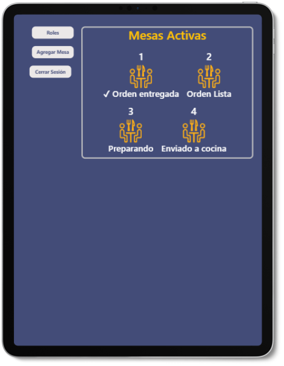
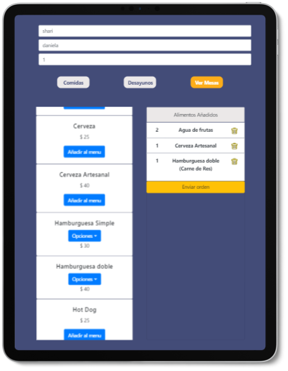
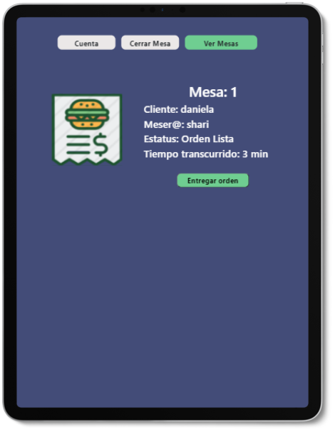
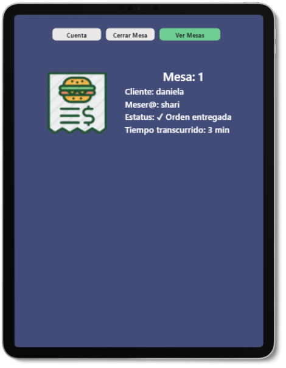

# BURGER QUEEN!!!!!

Es una aplicación PWA diseñada para la administración del flujo de clientes dentro de un restaurante de Hamburguesas.
Este restaurante requiere una aplicación donde sus empleados, tanto cocineros como meseros puedan seguir paso a paso el ciclo de vida que tienen cada uno de sus tareas, de una forma fácil y rápida. Lo cual les ayude con el control del restaurante, así como aumentar su productividad y minimizar sus tiempos de pedido-entrega.

Este proyecto fue creado con JS, React, bootstrap y Firebase. 

Diseño
Es una aplicación diseñada para iPad Pro, pensada para el uso exclusivo del personal autorizado por el gerente, los cuales estarán en contacto con el uso de la aplicación durante todo su turno de trabajo (4 a 8 hrs diarias)

Descripción del uso de la aplicación....

* Pare tener acceso a la aplicación el usuario debe registrarse, mediante un correo electrónico y una contraseña mayor a 6 caracteres, el gerente debe autorizar el registro de cada nuevo usuario.
* Una vez dentro de la aplicación los usuarios pueden elegir sus roles de trabajo dentro del restaurante, tendrán 2 opciones: meser@ y cociner@ 
* Los meseros podrán ver todas las mesas que estén activas de forma global, Número de mesa y estado de la orden en tiempo real (en cocina, preparando, orden lista, orden entregada).
* Los meseros pueden acceder a cada una de las mesas y ver sus características particulares: estado de la orden, nombre del cliente, tiempo de preparación, cuenta total, etc.
* Los meseros pueden abrir una mesa nueva, tomar la orden del cliente y enviar esta orden a cocina.
* Cuando el flujo de la orden se encuentre en su etapa final ("entregada al cliente"), los meseros pueden cerrar una mesa.
* En cocina pueden ver lar ordenes que van ingresando en tiempo real y cambiar el estado, la orden entra a cocina con un estado de "enviado a cocina", cuando su preparación comienza el estado cambia a "preparando" y cuando está lista para entregar al cliente cambia a "orden lista" 

### Para el uso de la app acceder al siguiente link: https://shari12.github.io/CDMX009-BurgerQueen/#/

El registro de nuevos usuarios debe ser autorizado por el gerente del restaurante mediante una contraseña 
### password  gerente: gerente 

# Objetivos de aprendizaje durante el proyecto 

Shari Dan

## HTML y CSS
- [ x ] [ x ] HTML semántico
- [ x ] [ x ] CSS flexbox
- [ x ] [ x ] Bootstrap
- [ x ] [ x ] Maquetación
## Frontend Development
- [ x ] [ x ] Componentes
- [ x] [ x ] Manejo del estado
## PWA
- [ x ] [ x ] Concepto
- [ x ] [ x ] Utilidad
- [  ] [  ] Que es Workbox
- [ x ] [ x ] Qué es un serviceWorker
## React
- [ x ] [ x ] JSX
- [ x ] [ x ] Componentes class y componentes function
- [ x ] [ x ] props
- [ x ] [ x ] Manejo de eventos
- [ x ] [ x ] Listas y keys
- [ x ] [ x ] Renderizado condicional
- [ x ] [ x ] Levantamiento de estados
- [ x ] [ x ] hooks
- [ x ] [ x ] CSS modules
- [ x] [ x ] React Router
## Firebase
- [ x ] [ x ] Firestore
- [ x ] [ x ] Firebase security rules
- [ x ] [ x ] Observables
## Testing
- [ x ] [ x ] Testeo de tus interfaces
- [ x] [ x ] Testeo de componentes
-  [ x  ] [ x ]Testeo asíncrono
-  [  x] [ x ]Mocking
## Colaboración en Github
- [ x ] [ x ] Branches
- [ x ] [ x ] Pull Requests
- [   ] [   ] Tags
## Organización en Github
- [ x ] [ x ] Projects
- [ x ] [ x ] Issues
- [ x ] [ x ] Labels
- [ x ] [ x ] Milestones
## Buenas prácticas de desarrollo
- [ x ] [ x ] Modularización
- [ x ] [ x ] Nomenclatura / Semántica
- [ x ] [ x ]Linting
